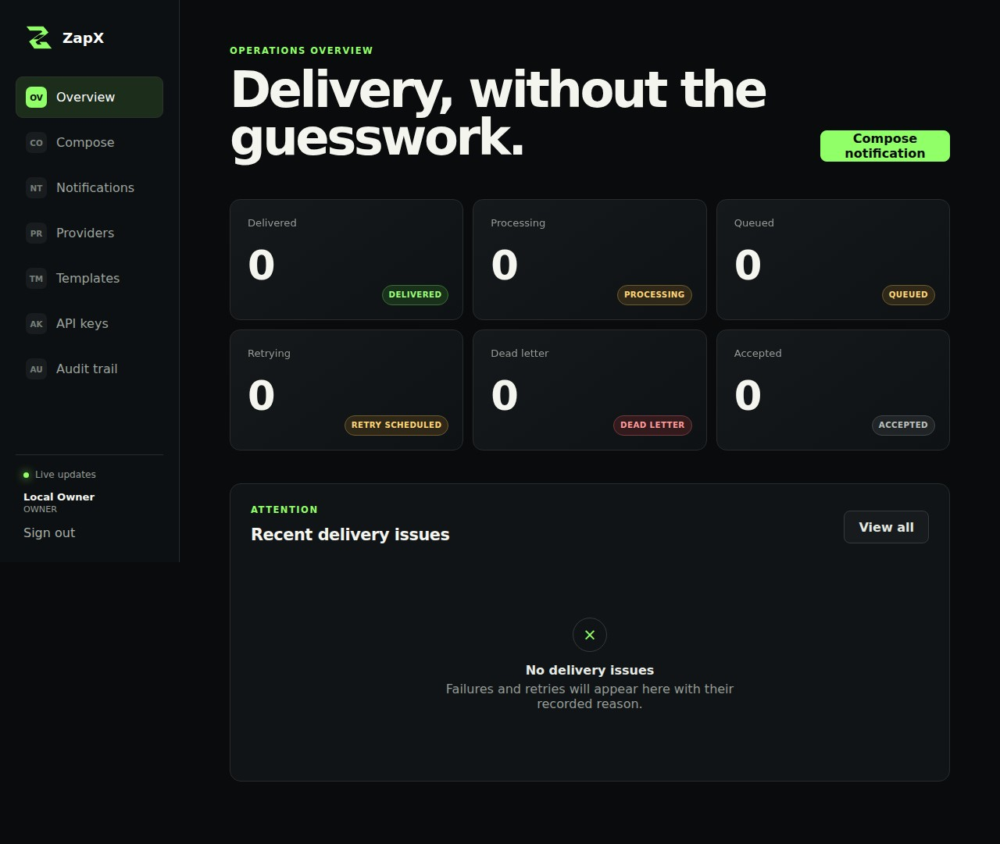
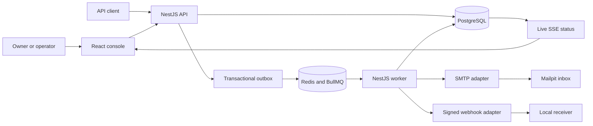
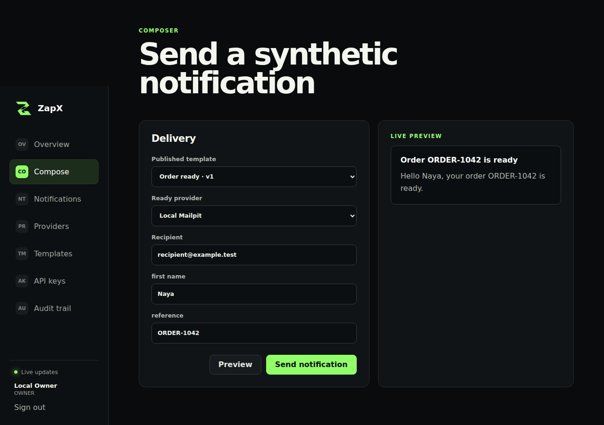
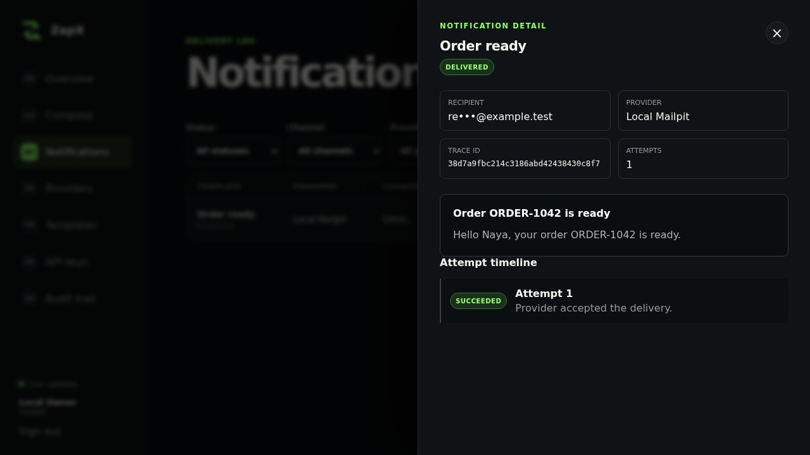

<p align="center">
  
</p>

# ZapX

ZapX is a local-first notification delivery product for teams that need to understand what happened after a message was accepted. It combines a web operations console, versioned templates, SMTP and signed-webhook delivery, durable queues, bounded retries, dead-letter recovery, and auditable access control.

**Release status:** complete for the documented local portfolio release. ZapX has no public deployment and uses synthetic local data and delivery targets.



## The problem

Calling an email or webhook provider is easy. Operating delivery during duplicate requests, provider failures, worker restarts, and retries is harder. ZapX gives each user a clear workflow:

- **Owners** configure providers, publish templates, manage API keys, and review audit evidence.
- **Operators** compose notifications, investigate attempts, and replay dead letters.
- **Viewers** inspect delivery state without mutation access.
- **API clients** submit idempotent notifications through narrowly scoped keys.

## Product flow



PostgreSQL is authoritative for notification, attempt, idempotency, outbox, identity, and audit state. Redis coordinates execution; it does not replace durable business state.

## End-user capabilities

- secure browser login with rotating access and refresh sessions;
- Owner, Operator, and Viewer authorization boundaries;
- one-time API key secrets with scopes and revocation;
- encrypted SMTP and webhook provider configuration with masked readback;
- bounded provider connection tests;
- immutable published template versions with validated previews;
- idempotent notification intake and atomic outbox persistence;
- live delivery counts and notification investigation through the console;
- status, channel, provider, and date filters;
- SMTP delivery to Mailpit and HMAC-signed webhook delivery;
- per-provider rate limiting, classified retries, dead letters, and audited replay;
- ordered attempt timelines with masked recipients and sanitized errors;
- retention cleanup for encrypted terminal payloads;
- health, dependency-aware readiness, Prometheus metrics, trace identities, and redacted structured logs.

## Product evidence

| Compose and validate                                                | Investigate a delivery                                                          |
| ------------------------------------------------------------------- | ------------------------------------------------------------------------------- |
|  |  |

The browser test proves the complete path from login and preview through queue processing, SMTP delivery, terminal status, attempt history, audit visibility, and the Mailpit inbox. CI retains the complete JPG set as the `zapx-browser-evidence` workflow artifact; the curated repository images and `DevLab/Porto/ZapX/` evidence were captured from that same verified journey.

## Engineering decisions

| Concern            | Choice                                                   | Reason                                                                                                |
| ------------------ | -------------------------------------------------------- | ----------------------------------------------------------------------------------------------------- |
| Language           | Strict TypeScript                                        | One checked language across browser, API, worker, and shared contracts.                               |
| API and worker     | NestJS with Fastify                                      | Explicit modules and dependency boundaries with a lean HTTP runtime.                                  |
| Web                | React with Vite                                          | Focused SPA console with fast local feedback.                                                         |
| Durable state      | PostgreSQL with explicit SQL repositories                | Transactions, constraints, row locks, and visible query behavior.                                     |
| Async delivery     | Redis and BullMQ                                         | Deterministic jobs, delayed retry, and worker coordination.                                           |
| Runtime validation | Zod                                                      | Validation at environment, command, and response boundaries.                                          |
| Local delivery     | Mailpit and a signed webhook receiver                    | End-to-end evidence without a paid provider or real recipient.                                        |
| Security           | Argon2id, SHA-256 token hashes, AES-256-GCM, HMAC-SHA256 | Separate storage controls for passwords, bearer tokens, encrypted payloads, and webhook authenticity. |
| Observability      | Pino, trace IDs, SSE, Prometheus text metrics            | Inspectable local behavior without claiming an external telemetry deployment.                         |

Production TypeScript files are capped at 300 lines and test files at 1,000 lines by an automated quality gate. Modules are split by responsibility rather than line count alone.

## Repository map

```text
apps/
├── api/                 # HTTP, auth, providers, templates, operations
├── web/                 # Responsive operator console
├── webhook-receiver/    # Signature-validating local target
└── worker/              # Outbox relay, queue consumer, retention
packages/
├── config/              # Environment schemas
├── contracts/           # Shared runtime contracts
├── database/            # Migrations and repositories
├── domain/              # Domain commands and invariants
├── observability/       # Redacted structured logger
└── security/            # Hashing, encryption, signatures
docs/
├── architecture/        # System, state, security, API, decisions
└── product/             # Brief, flows, criteria, definition of done
tests/browser/           # Real-browser product validation
```

## Run locally

### Requirements

- Node.js `24.15.0`
- pnpm `11.1.2`
- Docker with Docker Compose
- Google Chrome for browser validation

```bash
corepack enable
pnpm install --frozen-lockfile
cp .env.example .env
pnpm dev:infra
pnpm db:migrate
pnpm db:seed
```

Start each runtime in its own terminal:

```bash
pnpm dev:api
pnpm dev:worker
pnpm dev:web
pnpm dev:receiver
```

| Surface            | Address                                                |
| ------------------ | ------------------------------------------------------ |
| Web console        | `http://localhost:3000`                                |
| API / OpenAPI      | `http://localhost:4000` / `http://localhost:4000/docs` |
| Worker health      | `http://localhost:4001/health`                         |
| Webhook receiver   | `http://localhost:4010/health`                         |
| Mailpit            | `http://localhost:8026`                                |
| Prometheus metrics | `http://localhost:4000/metrics`                        |

Synthetic sign-in accounts:

| Role     | Email                 | Default local password |
| -------- | --------------------- | ---------------------- |
| Owner    | `owner@zapx.local`    | `local-zapx-owner`     |
| Operator | `operator@zapx.local` | `local-zapx-owner`     |
| Viewer   | `viewer@zapx.local`   | `local-zapx-owner`     |

Set `ZAPX_SEED_PASSWORD` before seeding to replace the default local-only password. Never reuse these credentials outside the synthetic environment.

## Verification

```bash
pnpm quality
pnpm test:integration
pnpm test:e2e
pnpm infra:validate
```

The suite includes domain and security unit tests, React component tests, PostgreSQL repository tests, API authorization and failure tests, real Redis/BullMQ and SMTP integration, webhook contract tests, a 1,000-notification synthetic terminal-state validation, and the browser flow shown above. GitHub Actions repeats the gates on `main`; a separate workflow scans repository history for secrets.

## Security and reliability

- Recipients, rendered payloads, and provider configuration use AES-256-GCM at rest.
- Passwords and API key secrets are never stored as plaintext.
- Session cookies use HttpOnly protection; mutations require a CSRF token.
- Intake and authentication endpoints are rate limited.
- Webhook delivery rejects redirects, applies a destination allowlist, and signs timestamped bodies.
- Notification creation and its outbox event commit in one transaction.
- Retries are bounded and jittered; replay appends audit and attempt history.
- Raw credentials are excluded from API responses, logs, fixtures, screenshots, and committed configuration.

See [the security model](docs/architecture/security-model.md), [state and reliability model](docs/architecture/state-and-reliability.md), and [engineering decisions](docs/architecture/engineering-decisions.md) for the detailed boundaries.

## Documentation

- [Product brief](docs/product/product-brief.md)
- [User flows](docs/product/user-flows.md)
- [Acceptance criteria and evidence](docs/product/acceptance-criteria.md)
- [Definition of done](docs/product/definition-of-done.md)
- [System architecture](docs/architecture/system-architecture.md)
- [Data model](docs/architecture/data-model.md)
- [API contract](docs/architecture/api-contract.md)
- [Phase 6 console record](docs/architecture/phase-6-console.md)
- [Phase 7 validation record](docs/architecture/phase-7-validation.md)

## Release boundary

ZapX is a complete local portfolio product. Public hosting, campaigns, scheduling, billing, organization invitations, SMS, push notifications, and third-party provider accounts remain outside this release. Local delivery evidence is intentional and stated explicitly throughout the repository.

## License

ZapX is available under the [MIT License](LICENSE).
