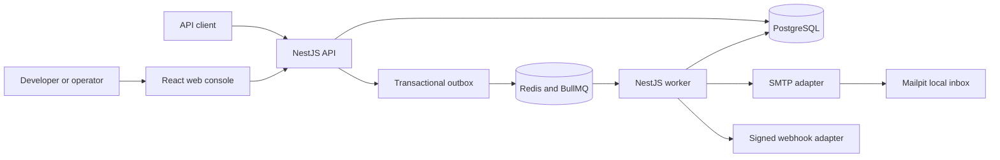

# ZapX

ZapX is a local-first notification delivery platform for developers and product teams. It is designed to accept SMTP email and signed webhook requests, execute them durably, and make queueing, retries, failures, and operator recovery visible.

> **Current status — Phase 3 complete:** the engineering foundation is implemented and tested. Notification creation, delivery, and recovery workflows begin in Phase 4. ZapX is not yet an end-user-ready product and has no public deployment.

## Why ZapX exists

Sending a request to a provider is straightforward. Operating notification delivery when providers slow down, duplicate requests arrive, or retries fail is harder. ZapX focuses on that operational gap:

- deterministic request acceptance and idempotency;
- durable work with explicit delivery state transitions;
- controlled retries and dead-letter recovery;
- signed outgoing webhooks and local SMTP delivery;
- a console that explains what happened instead of hiding it in logs.

The initial product boundary deliberately supports SMTP email and signed HTTP webhooks. Campaigns, scheduling, external provider accounts, and organization invitations remain outside the first release.

## Implemented foundation

- pnpm monorepo with isolated web, API, worker, and shared package boundaries;
- NestJS and Fastify API and worker runtimes with health endpoints;
- React and Vite web foundation with honest phase status;
- Zod runtime validation for environment and shared response contracts;
- structured Pino logging with sensitive field redaction;
- PostgreSQL, Redis, and Mailpit local infrastructure definitions;
- strict TypeScript, ESLint, Prettier, and automated file-size enforcement;
- unit, contract, component, and runtime integration tests;
- CI, secret scanning, Dependabot, issue forms, pull request guidance, and security policy.

## Architecture baseline



The API, outbox relay, and worker are separate runtime responsibilities inside a modular monolith. Phase 3 establishes the API and worker process boundaries. Persistence, queue execution, and provider adapters shown in the target architecture are implemented in later phases.

Detailed documents:

- [Product brief and PRD](docs/product/product-brief.md)
- [User flows](docs/product/user-flows.md)
- [Acceptance criteria](docs/product/acceptance-criteria.md)
- [Definition of done](docs/product/definition-of-done.md)
- [Technical specification](docs/architecture/technical-specification.md)
- [System architecture](docs/architecture/system-architecture.md)
- [Data model](docs/architecture/data-model.md)
- [API contract](docs/architecture/api-contract.md)
- [State and reliability model](docs/architecture/state-and-reliability.md)
- [Security model](docs/architecture/security-model.md)
- [Engineering decisions](docs/architecture/engineering-decisions.md)
- [Phase 3 implementation record](docs/architecture/phase-3-foundation.md)

## Technology choices

| Area           | Choice              | Reason                                                                      |
| -------------- | ------------------- | --------------------------------------------------------------------------- |
| Language       | TypeScript          | One strict type system across browser and server boundaries.                |
| API and worker | NestJS with Fastify | Explicit modules and dependency boundaries with a lean HTTP runtime.        |
| Web            | React with Vite     | Focused component model and fast local feedback.                            |
| Primary data   | PostgreSQL          | Transactions and constraints support delivery state and outbox consistency. |
| Queue          | Redis with BullMQ   | Delayed retries and worker primitives for the planned delivery pipeline.    |
| Local email    | Mailpit             | Inspectable SMTP behavior without sending real email.                       |
| Contracts      | Zod                 | Runtime validation can share types across trusted and untrusted boundaries. |
| Logs           | Pino                | Structured logs with low overhead and explicit redaction.                   |

## Workspace

```text
apps/
├── api/             # HTTP application boundary
├── web/             # Operator console
└── worker/          # Background execution boundary
packages/
├── config/          # Validated environment loading
├── contracts/       # Shared runtime contracts
└── observability/   # Structured logger construction
docs/
├── architecture/    # Technical design and decisions
└── product/         # Problem, scope, flows, and acceptance criteria
```

Production TypeScript files are limited to 300 lines and test files to 1,000 lines. The limit is automated, while module boundaries still follow responsibility rather than line count alone.

## Local setup

### Requirements

- Node.js `24.15.0`
- pnpm `11.1.2`
- Docker with Docker Compose for PostgreSQL, Redis, and Mailpit

```bash
corepack enable
pnpm install --frozen-lockfile
cp .env.example .env
pnpm dev:infra
```

Start each runtime in a separate terminal:

```bash
pnpm dev:api
pnpm dev:worker
pnpm dev:web
```

| Service        | Local address                  |
| -------------- | ------------------------------ |
| Web foundation | `http://localhost:3000`        |
| API health     | `http://localhost:4000/health` |
| API readiness  | `http://localhost:4000/ready`  |
| Worker health  | `http://localhost:4001/health` |
| Mailpit inbox  | `http://localhost:8026`        |
| PostgreSQL     | `localhost:5434`               |
| Redis          | `localhost:6381`               |

The current `/ready` response verifies the API process and validated configuration only. Database and queue dependency checks will be added with those integrations.

Stop local infrastructure with `pnpm infra:down`.

## Verification

```bash
pnpm quality
pnpm infra:validate
```

`pnpm quality` enforces file limits, formatting, linting, type safety, tests, and production builds. The current suite covers environment defaults and invalid input, shared health contracts, API and worker endpoints, and the web phase disclosure.

GitHub Actions repeats the complete quality gate and validates the Compose model on each push and pull request. A separate workflow scans repository history for committed secrets.

## Security and contribution

Read [SECURITY.md](SECURITY.md) before reporting a vulnerability and [CONTRIBUTING.md](CONTRIBUTING.md) before proposing a change. Never use real recipients, production credentials, employer data, or private endpoints in fixtures or issues.

## Roadmap

1. **Complete:** product definition and acceptance criteria.
2. **Complete:** architecture, contracts, reliability, and security design.
3. **Complete:** repository, runtimes, shared packages, local infrastructure, and quality automation.
4. **Next:** identity, projects, API keys, notification intake, persistence, and transactional outbox.
5. Queue execution, SMTP and signed webhook adapters, retries, and dead letters.
6. Operator console and live delivery visibility.
7. End-to-end validation and portfolio evidence.

See the [definition of done](docs/product/definition-of-done.md) for the release-level standard. A roadmap entry is only marked complete when its implementation and evidence are present.

## License

ZapX is available under the [MIT License](LICENSE).
