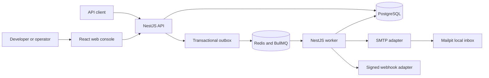

# ZapX

ZapX is a local-first notification delivery platform for developers and product teams. It is designed to accept SMTP email and signed webhook requests, execute them durably, and make queueing, retries, failures, and operator recovery visible.

> **Current status — Phase 5 complete:** ZapX accepts encrypted notifications, relays its transactional outbox through BullMQ, delivers local SMTP email or signed webhooks, records attempts, applies bounded retries, and supports audited dead-letter replay. Operator console workflows begin in Phase 6. ZapX is not yet an end-user-ready product and has no public deployment.

## Why ZapX exists

Sending a request to a provider is straightforward. Operating notification delivery when providers slow down, duplicate requests arrive, or retries fail is harder. ZapX focuses on that operational gap:

- deterministic request acceptance and idempotency;
- durable work with explicit delivery state transitions;
- controlled retries and dead-letter recovery;
- signed outgoing webhooks and local SMTP delivery;
- a console that explains what happened instead of hiding it in logs.

The initial product boundary deliberately supports SMTP email and signed HTTP webhooks. Campaigns, scheduling, external provider accounts, and organization invitations remain outside the first release.

## Implemented product foundation

- pnpm monorepo with isolated web, API, worker, and shared package boundaries;
- NestJS and Fastify API and worker runtimes with health endpoints;
- React and Vite web status surface with honest phase disclosure;
- rotating browser sessions in secure cookies with CSRF protection;
- workspace-scoped roles and revocable, one-time API key secrets;
- PostgreSQL migrations and synthetic local seed data;
- validated template rendering and idempotent notification intake;
- AES-256-GCM encryption for recipients and rendered content at rest;
- atomic notification, idempotency record, and outbox persistence;
- deterministic BullMQ publication with PostgreSQL-backed delivery state;
- SMTP delivery to a local inbox and HMAC-signed webhook delivery;
- SSRF-aware webhook destination checks and redirect refusal;
- classified provider outcomes, bounded jittered retries, and durable attempt history;
- dead-letter state with audited manual replay that retains earlier attempts;
- a local webhook receiver with signature, age, and duplicate validation;
- safe RFC 9457-style problem responses and local OpenAPI documentation;
- Zod runtime validation for environment and shared response contracts;
- structured Pino logging with sensitive field redaction;
- PostgreSQL, Redis, and Mailpit local infrastructure definitions;
- strict TypeScript, ESLint, Prettier, and automated file-size enforcement;
- unit, contract, component, and runtime integration tests;
- CI, secret scanning, Dependabot, issue forms, pull request guidance, and security policy.

## Architecture baseline



The complete backend path in this diagram is implemented through SMTP and webhook outcomes. PostgreSQL remains authoritative while Redis coordinates delivery execution. The React surface still reports product status; interactive operator workflows remain Phase 6 work.

Detailed documents:

- [Product brief and PRD](docs/product/product-brief.md)
- [User flows](docs/product/user-flows.md)
- [Acceptance criteria](docs/product/acceptance-criteria.md)
- [Definition of done](docs/product/definition-of-done.md)
- [Technical specification](docs/architecture/technical-specification.md)
- [System architecture](docs/architecture/system-architecture.md)
- [Data model](docs/architecture/data-model.md)
- [API contract](docs/architecture/api-contract.md)
- [State and reliability model](docs/architecture/state-and-reliability.md)
- [Security model](docs/architecture/security-model.md)
- [Engineering decisions](docs/architecture/engineering-decisions.md)
- [Phase 3 implementation record](docs/architecture/phase-3-foundation.md)
- [Phase 4 implementation record](docs/architecture/phase-4-intake.md)
- [Phase 5 implementation record](docs/architecture/phase-5-delivery.md)

## Technology choices

| Area           | Choice              | Reason                                                                      |
| -------------- | ------------------- | --------------------------------------------------------------------------- |
| Language       | TypeScript          | One strict type system across browser and server boundaries.                |
| API and worker | NestJS with Fastify | Explicit modules and dependency boundaries with a lean HTTP runtime.        |
| Web            | React with Vite     | Focused component model and fast local feedback.                            |
| Primary data   | PostgreSQL          | Transactions and constraints support delivery state and outbox consistency. |
| Queue          | Redis with BullMQ   | Delayed retries and worker primitives for the planned delivery pipeline.    |
| Local email    | Mailpit             | Inspectable SMTP behavior without sending real email.                       |
| Contracts      | Zod                 | Runtime validation can share types across trusted and untrusted boundaries. |
| Logs           | Pino                | Structured logs with low overhead and explicit redaction.                   |

## Workspace

```text
apps/
├── api/             # HTTP application boundary
├── web/             # Operator console
├── webhook-receiver/ # Local signed-webhook destination
└── worker/          # Outbox relay and delivery execution
packages/
├── config/          # Validated environment loading
├── contracts/       # Shared runtime contracts
├── database/        # PostgreSQL migrations and repositories
├── domain/          # Identity and notification rules
├── observability/   # Structured logger construction
└── security/        # Secret hashing, token hashing, and payload encryption
docs/
├── architecture/    # Technical design and decisions
└── product/         # Problem, scope, flows, and acceptance criteria
```

Production TypeScript files are limited to 300 lines and test files to 1,000 lines. The limit is automated, while module boundaries still follow responsibility rather than line count alone.

## Local setup

### Requirements

- Node.js `24.15.0`
- pnpm `11.1.2`
- Docker with Docker Compose for PostgreSQL, Redis, and Mailpit

```bash
corepack enable
pnpm install --frozen-lockfile
cp .env.example .env
pnpm dev:infra
pnpm db:migrate
pnpm db:seed
```

Start each runtime in a separate terminal:

```bash
pnpm dev:api
pnpm dev:worker
pnpm dev:web
pnpm dev:receiver
```

| Service       | Local address                  |
| ------------- | ------------------------------ |
| Web status    | `http://localhost:3000`        |
| API health    | `http://localhost:4000/health` |
| API readiness | `http://localhost:4000/ready`  |
| API docs      | `http://localhost:4000/docs`   |
| Worker health | `http://localhost:4001/health` |
| Worker ready  | `http://localhost:4001/ready`  |
| Webhook local | `http://localhost:4010/health` |
| Mailpit inbox | `http://localhost:8026`        |
| PostgreSQL    | `localhost:5434`               |
| Redis         | `localhost:6381`               |

The synthetic seed creates `owner@zapx.local` with password `local-zapx-owner`, ready local SMTP and webhook connections, and one published template for local evaluation. Set `ZAPX_SEED_PASSWORD` before seeding to choose a different local password.

API readiness checks PostgreSQL. Worker readiness checks both PostgreSQL and Redis.

Stop local infrastructure with `pnpm infra:down`.

## Verification

```bash
pnpm quality
pnpm test:integration
pnpm infra:validate
```

`pnpm quality` enforces file limits, formatting, linting, type safety, tests, and production builds. Integration tests verify migrations, identity, encrypted intake, outbox publication, Redis queue execution, real SMTP transport, delivery state, retry exhaustion, dead-letter replay, CSRF enforcement, and audit evidence.

GitHub Actions repeats the complete quality gate and validates the Compose model on each push and pull request. A separate workflow scans repository history for committed secrets.

## Security and contribution

Read [SECURITY.md](SECURITY.md) before reporting a vulnerability and [CONTRIBUTING.md](CONTRIBUTING.md) before proposing a change. Never use real recipients, production credentials, employer data, or private endpoints in fixtures or issues.

## Roadmap

1. **Complete:** product definition and acceptance criteria.
2. **Complete:** architecture, contracts, reliability, and security design.
3. **Complete:** repository, runtimes, shared packages, local infrastructure, and quality automation.
4. **Complete:** identity, workspace access, API keys, notification intake, persistence, and transactional outbox.
5. **Complete:** outbox relay, queue execution, SMTP and signed webhook adapters, retries, dead letters, and manual recovery.
6. **Next:** operator console, provider and template management, notification detail, and live delivery visibility.
7. End-to-end validation and portfolio evidence.

See the [definition of done](docs/product/definition-of-done.md) for the release-level standard. A roadmap entry is only marked complete when its implementation and evidence are present.

## License

ZapX is available under the [MIT License](LICENSE).
