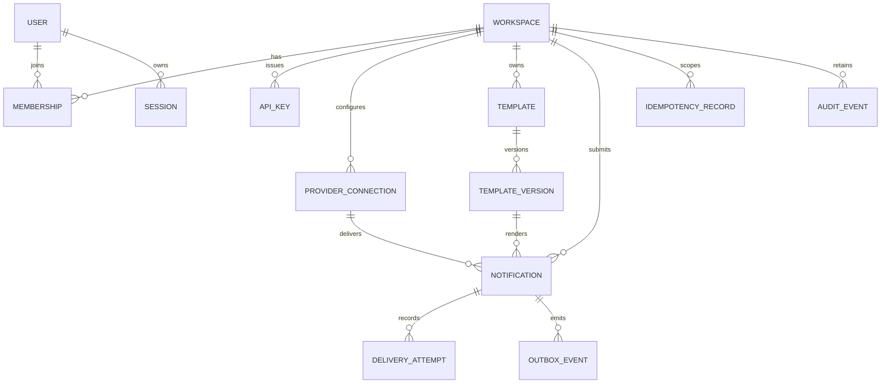

# ZapX data model

## Relationship overview

## Shared conventions

- Primary identifiers are UUIDv7 values generated by the application.
- Mutable tables include `created_at`, `updated_at`, and integer `version` for optimistic concurrency where needed.
- Every workspace-owned unique constraint includes `workspace_id`.
- Timestamp columns use UTC `timestamptz`.
- Enumerated domain values use constrained text or database enums selected during migration implementation.
- Secrets and message content use explicit ciphertext, nonce, key version, and associated-data fields.
- Soft deletion is limited to user-facing configuration that must retain historical references; notifications and attempts are retention-managed instead.

## Identity and access

### `workspaces`

- `id`
- `slug` unique
- `name`
- `status`
- timestamps

### `users`

- `id`
- normalized `email` unique
- `display_name`
- `password_hash`
- `status`
- `last_login_at`
- timestamps

### `memberships`

- `workspace_id`
- `user_id`
- `role`: `OWNER`, `OPERATOR`, or `VIEWER`
- timestamps
- unique `(workspace_id, user_id)`

### `sessions`

- `id`
- `user_id`
- `refresh_token_hash`
- `token_family_id`
- `expires_at`
- `rotated_at`
- `revoked_at`
- client metadata sanitized to a bounded representation

### `api_keys`

- `id`
- `workspace_id`
- `name`
- non-secret lookup prefix
- `secret_hash`
- `scopes`
- `last_used_at`
- `expires_at`
- `revoked_at`
- creator and timestamps

## Provider and template configuration

### `provider_connections`

- `id`
- `workspace_id`
- `name`
- `kind`: `SMTP` or `WEBHOOK`
- encrypted configuration fields
- `key_version`
- `status`: `DRAFT`, `READY`, `DISABLED`, or `UNHEALTHY`
- `last_tested_at`
- `last_test_result`
- creator and timestamps

Provider secrets never appear in query projections returned to the browser.

### `templates`

- `id`
- `workspace_id`
- `name`
- `channel`
- `status`
- timestamps
- unique `(workspace_id, name)` among active templates

### `template_versions`

- `id`
- `template_id`
- monotonically increasing `version_number`
- subject template when channel supports it
- body template
- variable schema JSON
- `published_at`
- creator and timestamps
- unique `(template_id, version_number)`

Published versions are immutable.

## Notification and delivery

### `notifications`

- `id`
- `workspace_id`
- `template_version_id`
- `provider_connection_id`
- `channel`
- encrypted normalized recipient
- recipient fingerprint generated with keyed HMAC
- encrypted rendered subject and body
- `payload_key_version`
- `status`
- `attempt_count`
- `next_attempt_at`
- `last_error_code`
- `accepted_at`
- `terminal_at`
- `retained_payload_until`
- creator kind and identifier
- timestamps and optimistic `version`

One P0 notification targets one recipient through one channel and provider. A future batch product creates multiple notification aggregates rather than overloading this record.

### `delivery_attempts`

- `id`
- `notification_id`
- monotonic `attempt_number`
- provider request identity when available
- `outcome`: `SUCCEEDED`, `TRANSIENT_FAILURE`, `PERMANENT_FAILURE`, or `INDETERMINATE`
- sanitized error code and bounded summary
- sanitized and truncated provider metadata
- `started_at`
- `finished_at`
- `duration_ms`
- `trace_id`
- unique `(notification_id, attempt_number)`

Attempt rows are append-only.

### `idempotency_records`

- `id`
- `workspace_id`
- `operation`
- `idempotency_key_hash`
- canonical request hash
- resource type and resource identity
- bounded response snapshot
- `expires_at`
- timestamps
- unique `(workspace_id, operation, idempotency_key_hash)`

Raw idempotency keys are not retained.

### `outbox_events`

- `id`
- `aggregate_type`
- `aggregate_id`
- `event_type`
- schema version
- serialized event payload containing identifiers rather than secrets
- `occurred_at`
- `published_at`
- `publish_attempts`
- `last_publish_error`
- index on unpublished rows ordered by occurrence and identity

### `audit_events`

- `id`
- `workspace_id`
- actor type, retained actor label, and optional actor identity
- action
- target type and identity
- sanitized metadata
- `occurred_at`
- `trace_id`

Audit events are append-only and keep an actor label after account removal.

## Important constraints

- A published template version cannot be updated or deleted while referenced.
- A disabled provider remains readable by historical notifications.
- A notification cannot reference a provider or template from another workspace.
- `attempt_count` equals the greatest committed attempt number.
- Terminal timestamps are required for `DELIVERED` and `DEAD_LETTER`.
- `next_attempt_at` is populated only for `RETRY_SCHEDULED`.
- Status changes use optimistic version checks to prevent competing workers from applying incompatible transitions.

## Index strategy

- Notifications: `(workspace_id, created_at desc, id desc)`.
- Notification filters: `(workspace_id, status, created_at desc)` and `(workspace_id, channel, created_at desc)`.
- Attempts: `(notification_id, attempt_number)`.
- Outbox relay: partial index for `published_at is null` ordered by `occurred_at`.
- API-key lookup: unique prefix plus hash verification.
- Sessions: token family and expiry indexes.
- Audit: `(workspace_id, occurred_at desc, id desc)`.

Exact indexes are confirmed with query plans in the implementation dataset.

## Retention and erasure

- The retention worker clears encrypted recipient and rendered content after seven days in terminal state.
- Metadata stays queryable for 90 days, after which notification and attempt rows may be purged in bounded batches.
- Audit events remain for 180 days.
- Metrics contain no recipient or message content.
- Erasure replaces content fields with null and records the retention timestamp; it does not rewrite attempt outcomes or audit history.
