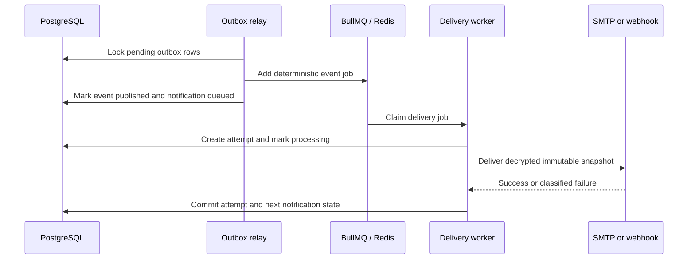

# Phase 5 implementation record

## Objective

Phase 5 turns an accepted notification into a durable provider outcome. It connects the transactional outbox to Redis and BullMQ, executes SMTP or signed webhook delivery, records every attempt, applies bounded automatic retries, and preserves terminal failures for audited manual replay.

## Implemented flow

PostgreSQL is the product source of truth. Redis stores execution state and delay timing without becoming the authoritative source for notification status.

## Outbox and queue reliability

- Relay selection uses deterministic ordering and `FOR UPDATE SKIP LOCKED`.
- The outbox event UUID is the BullMQ `jobId`; repeated publication resolves to the same retained job.
- Queue insertion and PostgreSQL acknowledgement run while the relay owns the row lock.
- A publication error increments `publish_attempts`, stores a bounded safe summary, and leaves the event pending.
- BullMQ completion records are retained for one day, which covers the queue-insert/database-acknowledgement recovery window.
- Worker shutdown stops relay polling and closes worker, queue, and database resources cleanly.

## Delivery state and attempts

- A worker transaction changes `QUEUED` or `RETRY_SCHEDULED` to `PROCESSING`, allocates the monotonic attempt number, and inserts the attempt before provider I/O.
- Provider I/O occurs outside a long PostgreSQL transaction.
- Success commits `SUCCEEDED` and `DELIVERED` with a terminal timestamp.
- Temporary failures commit `TRANSIENT_FAILURE` and `RETRY_SCHEDULED` before BullMQ applies the matching delay.
- Permanent, indeterminate, and exhausted failures commit `DEAD_LETTER` while retaining prior attempts.
- Reprocessing a stalled `PROCESSING` job conservatively records `INDETERMINATE` and dead letters it instead of risking an invisible duplicate provider call.
- Manual replay resets only the automatic retry cycle. Global attempt numbering and historical rows remain intact.

## Provider behavior

### SMTP

- Nodemailer uses bounded connect, greeting, and socket timeouts.
- Delivery includes stable delivery and trace headers.
- Clear SMTP `5xx` responses are permanent; `4xx` and pre-data connection failures are transient.
- A timeout or socket failure during `DATA` is indeterminate and requires operator review.
- The synthetic local provider targets Mailpit and never sends public email.

### Signed webhook

- The worker signs `v1.<timestamp>.<delivery-id>.<exact-body>` with HMAC-SHA-256.
- Requests include delivery, trace, timestamp, and signature headers.
- Redirects are refused and total request time is bounded.
- Private, loopback, link-local, multicast, and metadata destinations are rejected unless the hostname appears in the explicit local allowlist.
- `408`, `425`, `429`, and `5xx` responses are transient. Other `4xx` responses are permanent. Network ambiguity is dead lettered as indeterminate.
- The local receiver verifies signature age and exact bytes, and identifies duplicate delivery IDs.

## Retry and recovery

Each delivery cycle permits three automatic attempts. Failures after attempts one and two use deterministic bounded jitter around 5 seconds and 30 seconds. Attempt three dead letters the notification. The previously designed two-minute fourth delay is no longer used because the P0 limit is three total attempts.

`POST /v1/notifications/:id/replay` is workspace scoped and requires write access. It changes only a dead letter back to `ACCEPTED`, creates a new outbox event, resets the cycle counter, and records an audit event in the same transaction.

## Verification evidence

- Unit tests cover jitter bounds, exhaustion, provider response classification, SSRF rejection, exact webhook signatures, receiver replay behavior, and worker readiness.
- PostgreSQL integration tests cover outbox publication, persisted relay failure, attempts, retry scheduling, terminal state, replay, retained numbering, and replay audit evidence.
- API integration tests cover authorized dead-letter replay and its outbox and audit records.
- The delivery integration test uses PostgreSQL, Redis, BullMQ, and a real local SMTP server to prove encrypted intake reaches `DELIVERED` with one `SUCCEEDED` attempt and the original trace identity.
- CI also repeats Compose validation and repository secret scanning.

## Migration and rollback

Migration `002_phase_5_delivery.sql` is additive. It introduces encrypted provider configuration fields, delivery state metadata, and append-only attempt rows. Rollback uses the Phase 4 application revision while retaining the added nullable columns and table; destructive removal is deferred until a later compatibility window. Local disposable environments can reset volumes and reapply both migrations plus synthetic seed data.

## Known limits

- The web app remains a product-status surface. Login, provider/template management, notification detail, filtering, and replay controls are Phase 6.
- Provider configuration is created by the synthetic seed; management endpoints are not implemented.
- Worker concurrency is bounded globally. Per-provider throughput limits remain future work.
- Metrics, reconciliation, retention erasure, and live SSE visibility are not implemented.
- The local webhook receiver keeps duplicate identities in memory and is intended only for repeatable local validation.
- ZapX runs locally and has no public deployment.

## Phase 6 entry criteria

Phase 6 may start after local quality checks, PostgreSQL and Redis integration tests, real SMTP delivery validation, GitHub CI, dependency audit, and secret scanning pass for this implementation record and committed code.
