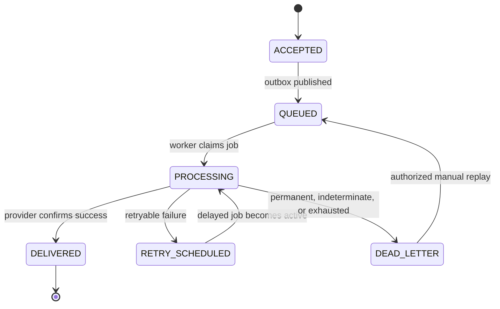

# ZapX state and reliability model

## Notification states

`DELIVERED` is terminal. `DEAD_LETTER` is terminal for automatic processing but permits an audited manual replay. Replay increments the attempt sequence and does not delete or rewrite earlier attempts.

## Attempt outcomes

| Outcome             | Meaning                                                               | Default action                  |
| ------------------- | --------------------------------------------------------------------- | ------------------------------- |
| `SUCCEEDED`         | Provider confirmed acceptance under its contract                      | Mark delivered                  |
| `TRANSIENT_FAILURE` | Temporary condition with safe retry behavior                          | Schedule bounded retry          |
| `PERMANENT_FAILURE` | Invalid recipient, rejected content, or non-recoverable configuration | Dead letter                     |
| `INDETERMINATE`     | Provider may have accepted the message but acknowledgement is unknown | Dead letter for operator review |

The indeterminate outcome prevents blind automatic retry where a duplicate external message is more harmful than delayed manual investigation.

## Retry policy baseline

- Maximum three automatic attempts in P0.
- Exponential schedule based on 5 seconds, 30 seconds, and 2 minutes.
- Bounded random jitter prevents synchronized retries.
- Provider `Retry-After` may extend the next attempt but cannot bypass the configured maximum delay.
- Authentication, validation, signature, unsupported content, and clear recipient rejection are permanent.
- Timeouts and connection failures are classified by adapter phase; ambiguous post-send failures become indeterminate.
- Manual replay is a separate authorized action and is not counted as an automatic retry.

These values are defaults and are verified during failure testing. User-configurable retry policy remains P1.

## Transactional intake

The API performs one PostgreSQL transaction:

1. Reserve or resolve the scoped idempotency record.
2. Validate workspace references under the same authorization boundary.
3. Render and encrypt the immutable message snapshot.
4. Insert notification with `ACCEPTED` status.
5. Insert versioned outbox event.
6. Store the bounded idempotent response snapshot.
7. Commit.

No queue call occurs inside the database transaction.

## Outbox publication

- Relay workers select pending events in deterministic order with `FOR UPDATE SKIP LOCKED`.
- Each queue job uses the outbox event identity as `jobId`.
- After successful queue insertion, the relay marks the event published.
- A crash after queue insertion but before database acknowledgement may cause another insertion attempt; deterministic job identity and worker-side state checks make that safe.
- Repeated publication failures leave the outbox row pending and surface metrics and readiness degradation.

## Worker claim and concurrency

- The worker loads the notification and attempts an optimistic status transition.
- A worker that loses the version race exits without calling the provider.
- The next attempt number is allocated transactionally with a unique database constraint.
- Provider calls happen outside a long-held database transaction.
- The result is committed using the expected notification version; reconciliation handles the unlikely lost-result race.

## Provider idempotency

- Webhook delivery sends a stable `ZapX-Delivery-Id`, timestamp, and HMAC signature. A compliant receiver can deduplicate the delivery identity.
- Provider adapters pass an idempotency token when the provider supports one.
- SMTP does not provide universal end-to-end idempotency. The adapter distinguishes pre-send failures from ambiguous post-send failures and exposes that limit.
- ZapX claims one logical intake and controlled attempts, not universal exactly-once external delivery.

## Rate limiting

- API intake has per-workspace and per-key limits.
- Authentication has per-origin and per-account defensive limits.
- Worker throughput has per-provider-connection limits.
- Rate-limited queue work remains waiting or delayed and does not count as a delivery attempt until the provider call starts.

## Reconciliation

A periodic reconciliation job identifies:

- accepted notifications without a pending or published outbox event;
- queued or processing notifications without a live job beyond the recovery threshold;
- attempt rows without a compatible aggregate status;
- published outbox events whose notification is still accepted;
- expired idempotency and session records;
- payloads eligible for retention erasure.

Reconciliation repairs only unambiguous internal state. Ambiguous provider outcomes remain visible for operator action.

## Readiness behavior

| Dependency state       | Intake                                                 | Queries     | Worker                                 | Readiness                      |
| ---------------------- | ------------------------------------------------------ | ----------- | -------------------------------------- | ------------------------------ |
| PostgreSQL unavailable | Reject                                                 | Unavailable | Stop claims                            | False                          |
| Redis unavailable      | Accept only while bounded outbox backlog policy allows | Available   | Pause                                  | Degraded or false at threshold |
| Provider unavailable   | Accept if provider remains configured                  | Available   | Retry or dead letter by classification | API ready; provider unhealthy  |
| Telemetry unavailable  | Continue with local structured logs                    | Available   | Continue                               | Ready with telemetry warning   |

The bounded outbox backlog threshold prevents unlimited acceptance while delivery infrastructure is unavailable.

## Graceful shutdown

- API stops accepting new connections, completes bounded requests, and closes telemetry.
- Relay stops claiming batches, completes or releases its current transaction, and closes clients.
- Worker stops fetching new jobs, finishes within a deadline, or lets BullMQ recover the job after lock expiry.
- Provider clients have explicit connect and request deadlines shorter than shutdown timeout.

## Reliability tests

- Competing outbox relays.
- Duplicate API request and conflicting idempotency payload.
- Worker crash before provider call.
- Worker crash after provider result but before state commit.
- Redis loss with pending PostgreSQL outbox.
- SMTP rejection and ambiguous connection loss.
- Webhook `429`, `500`, timeout, invalid certificate simulation where supported, and connection reset.
- Retry exhaustion, dead letter, permission rejection, and manual replay.
- Graceful and forced worker restart.
- 1,000-notification simulated-provider validation batch.
