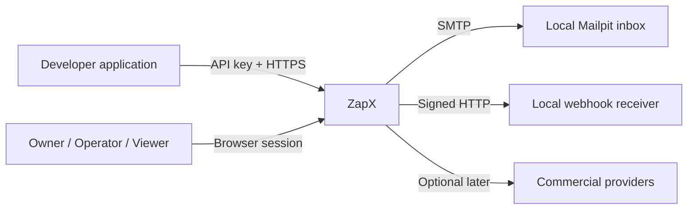
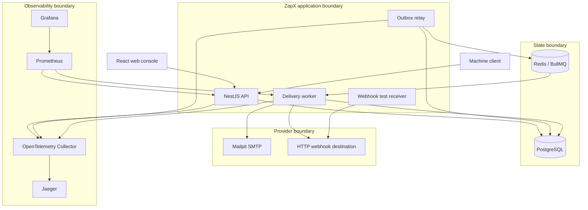
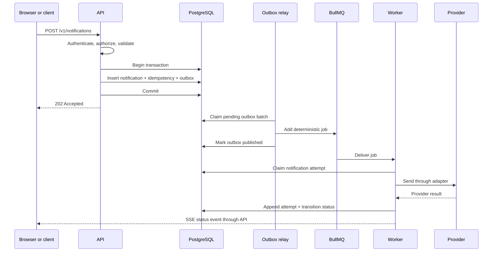

# ZapX system architecture

## Context



## Containers and trust boundaries



## Primary command flow



## Query flow

Read endpoints query PostgreSQL through workspace-scoped repositories. The API returns explicit pagination cursors and never derives authoritative status from BullMQ.

## Dependency rules

```text
delivery adapters ──→ provider-sdk interfaces
persistence adapters ──→ domain repository interfaces
API controllers ──→ application services ──→ domain
worker processors ──→ application services ──→ domain
domain ──→ no framework, database, Redis, or HTTP package
```

The domain package contains values, policies, state transitions, and ports. NestJS modules compose concrete adapters at application startup.

## Scaling model

- API instances are stateless apart from browser session and connection coordination stored in shared dependencies.
- Outbox relay instances coordinate with PostgreSQL row locks.
- Worker concurrency scales horizontally while BullMQ applies the configured provider limits.
- SSE initially uses one API instance in local mode. A future multi-instance deployment can fan out committed status events through Redis pub/sub without changing the public contract.

## Failure ownership

| Failure                    | Owner           | Durable evidence                       | User behavior                                     |
| -------------------------- | --------------- | -------------------------------------- | ------------------------------------------------- |
| Invalid request            | API             | Optional security log; no notification | Field-level problem response                      |
| PostgreSQL unavailable     | API or worker   | Runtime telemetry                      | Intake rejected; readiness false                  |
| Redis unavailable          | Relay or worker | Pending outbox remains in PostgreSQL   | Accepted work remains pending; readiness degraded |
| Provider transient failure | Worker          | Attempt row                            | Retry scheduled visibly                           |
| Provider permanent failure | Worker          | Attempt row                            | Dead letter visible                               |
| Ambiguous provider result  | Worker          | Indeterminate attempt                  | No blind automatic duplicate; operator review     |
| Browser SSE disconnected   | Browser and API | Connection metric                      | Visible disconnected state and refresh fallback   |

## Local service topology

Docker Compose starts web, API, worker, webhook receiver, PostgreSQL, Redis, Mailpit, OpenTelemetry Collector, Prometheus, Grafana, and Jaeger. Profiles may disable the observability UI for fast unit work, while the complete validation profile starts every service.
